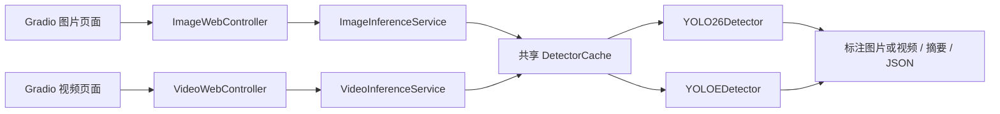
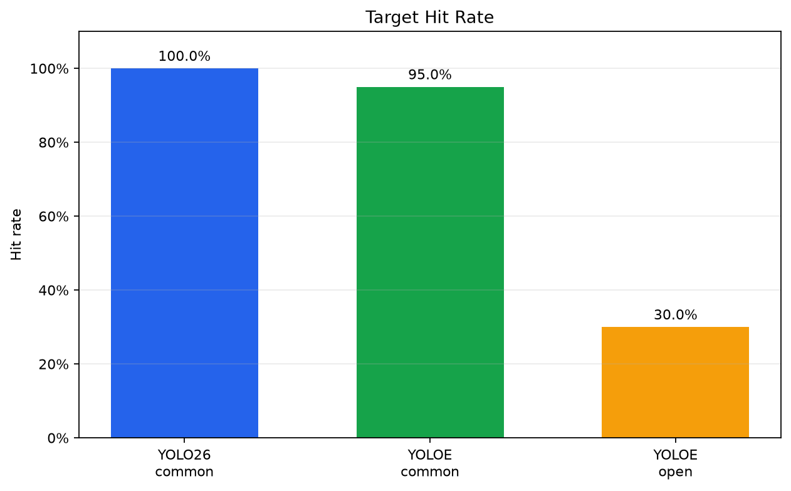
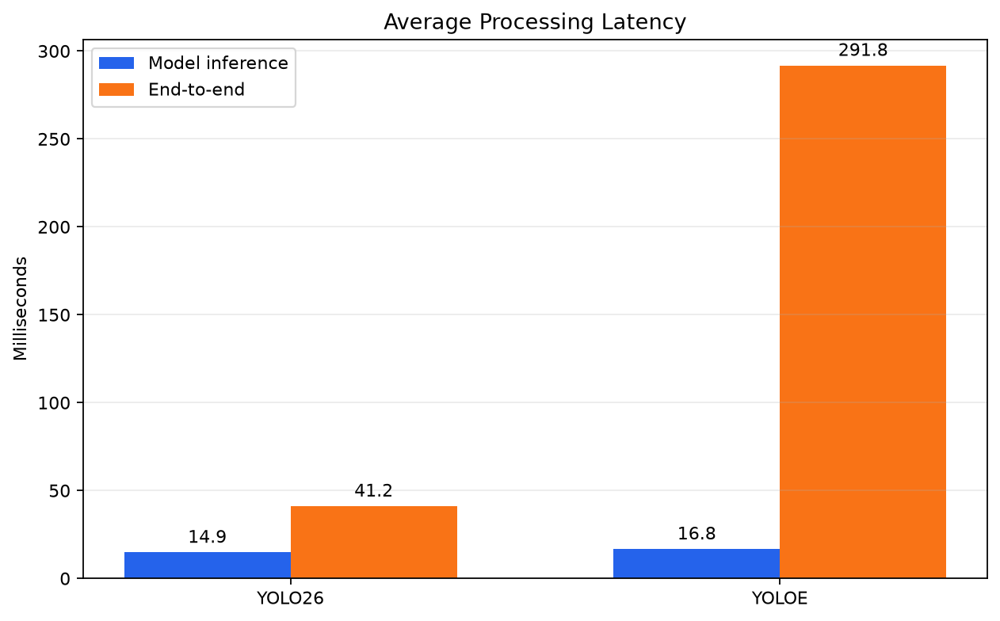

# YOLO26 Zero-Shot Vision Studio

一个基于 Ultralytics YOLO26 与 YOLOE-26 的目标检测学习项目，提供固定类别检测、开放词汇零样本检测，以及图片和视频 Gradio Web 界面。

项目重点不是重新发明 YOLO，而是完整实践模型调用、统一结果建模、异常处理、模型缓存、自动测试和 Web 应用集成。

## 项目功能

- YOLO26：使用 COCO 预训练类别进行免训练图片和视频检测
- YOLOE-26：通过英文文本提示进行开放词汇零样本检测
- 在图片、视频两个 Web 页面切换两种模型
- 设置置信度、IoU 和输入尺寸
- 展示标注图片、检测类别、置信度、坐标和推理耗时
- 下载标注图片和结构化 JSON 结果
- 逐帧处理短视频，显示处理进度并输出浏览器可播放的 H.264 MP4
- 展示视频帧数、逐帧检测框合计、平均推理耗时和整体处理速度
- 按需加载并缓存模型，避免每次请求重新加载权重
- 对输入缺失、空提示词、非法参数和 CUDA 显存不足显示中文错误
- 使用 pytest 和 Mock 覆盖核心逻辑，不依赖 GPU 运行单元测试

当前版本已完成图片、视频检测，以及包含 40 张图片和 80 行模型结果的正式对比实验。

## 页面工作流程



这套分层让 Gradio 页面不直接依赖 Ultralytics `Results`。两个页面共享模型缓存，并通过同一个 GPU 并发组串行执行推理任务。

## YOLO26 与 YOLOE 的区别

| 模式 | 类别来源 | 是否需要本项目训练 | 适合场景 |
|---|---|---:|---|
| YOLO26 | 固定 COCO 类别 | 否 | 人、车辆、动物等常见目标 |
| YOLOE-26 | 用户输入的英文文本类别 | 否 | 开放类别、卡通形象、特定描述的目标 |

“零样本”表示用户不需要为新提示词重新训练当前模型，不代表模型一定认识任何概念。结果仍会受到图片域、提示词、目标大小、遮挡和阈值影响。

## 已验证环境

- Windows 11
- Python 3.12.4
- PyTorch 2.14.0+cu130
- CUDA 13.0
- Ultralytics 8.4.147
- Gradio 6.27.0
- NVIDIA GeForce RTX 4060 Laptop GPU，8 GB 显存

其他满足依赖要求的 Windows、Linux、CUDA 或 CPU 环境也可能运行，但目前尚未完成跨平台验证。

## 快速开始

### 1. 克隆项目

建议将仓库放在空间充足的磁盘：

```powershell
git clone https://github.com/IniJyou/yolo26-zero-shot-vision-studio.git
cd yolo26-zero-shot-vision-studio
```

### 2. 创建虚拟环境

```powershell
python -m venv .venv
.\.venv\Scripts\Activate.ps1
```

如果 PowerShell 禁止激活脚本，也可以直接使用虚拟环境解释器：

```powershell
.\.venv\Scripts\python.exe -m pip --version
```

### 3. 安装依赖

GPU 用户应先按照自己的显卡和 CUDA 环境安装合适的 PyTorch，然后安装本项目：

```powershell
python -m pip install -e ".[dev]"
```

验证环境：

```powershell
python -c "import torch; print(torch.__version__); print(torch.cuda.is_available()); print(torch.cuda.get_device_name(0) if torch.cuda.is_available() else 'CPU')"
python -c "import ultralytics, gradio; print(ultralytics.__version__); print(gradio.__version__)"
```

### 4. 将缓存保存在 D 盘（可选）

Windows 用户可以调整以下路径：

```powershell
New-Item -ItemType Directory -Force D:\ai-cache\pip
New-Item -ItemType Directory -Force D:\ai-cache\gradio
setx PIP_CACHE_DIR "D:\ai-cache\pip"
setx GRADIO_TEMP_DIR "D:\ai-cache\gradio"
```

重新打开终端后生效。项目通过相对路径使用仓库内的 `weights/`、`datasets/` 和 `runs/`，因此将仓库放在 D 盘即可让这些内容保留在 D 盘。

### 5. 准备模型权重

应用当前使用：

```text
weights/yolo26n.pt
weights/yoloe-26n-seg.pt
weights/mobileclip2_b.ts
```

可在 `weights` 目录运行一次官方命令完成下载和验证：

```powershell
cd weights
yolo predict model=yolo26n.pt source="https://ultralytics.com/images/bus.jpg" device=0 project="..\runs" name="setup_yolo26" save=True
yolo predict model=yoloe-26n-seg.pt source="bus.jpg" classes="double-decker bus,person" device=0 conf=0.20 project="..\runs" name="setup_yoloe" save=True
cd ..
```

权重文件不会提交到 GitHub。

### 6. 启动 Web 应用

```powershell
python app.py
```

浏览器通常会自动打开：

```text
http://127.0.0.1:7860
```

当前启动配置仅监听本机地址，并关闭 Gradio 公网分享链接。

## Web 页面使用方法

### YOLO26 固定类别检测

1. 上传 JPG、PNG、BMP 或 WebP 图片。
2. 选择 `YOLO26`。
3. 保持默认参数或按需调整。
4. 点击“开始检测”。

### YOLOE 零样本检测

1. 上传图片。
2. 选择 `YOLOE`。
3. 使用英文逗号分隔提示词，例如：

```text
double-decker bus, person
```

4. 点击“开始检测”。

提示词会自动去除空白和重复类别。YOLOE 模式不允许空提示词。

### 视频检测

1. 打开“视频检测”页面并上传视频。
2. 选择 `YOLO26` 或 `YOLOE`；YOLOE 需要填写英文提示词。
3. 调整置信度、IoU 和输入尺寸。
4. 点击“开始处理视频”，等待逐帧处理完成。
5. 在页面播放结果，并下载 H.264 MP4 和逐帧 JSON。

当前版本限制视频最长 30 秒、上传文件最大 100 MB，输出视频保留原尺寸和播放帧率，但不保留原音轨。

## Python 示例

```powershell
python examples\01_yolo26_image.py
python examples\02_yoloe_image.py
python examples\03_image_service.py
python examples\04_create_demo_video.py
python examples\05_video_service.py
```

- `01_yolo26_image.py`：基础 YOLO26 图片检测
- `02_yoloe_image.py`：YOLOE 文本提示检测
- `03_image_service.py`：使用缓存和服务层完成图片检测
- `04_create_demo_video.py`：创建短视频测试素材
- `05_video_service.py`：运行视频服务并输出 MP4 与 JSON

## JSON 输出

图片 Web 请求保存在 `runs/web/<request-id>/`，视频请求保存在 `runs/video/<request-id>/`。每次请求都有独立目录，避免结果相互覆盖。图片 JSON 结构示例：

```json
{
  "model": "yoloe-26n-seg.pt",
  "mode": "YOLOE",
  "prompts": ["double-decker bus", "person"],
  "image_size": {
    "width": 810,
    "height": 1080
  },
  "speed_ms": {
    "preprocess": 31.9,
    "inference": 13.82,
    "postprocess": 6.1,
    "total": 51.82
  },
  "detection_count": 5,
  "detections": [
    {
      "class_id": 1,
      "label": "person",
      "confidence": 0.9062,
      "bbox_xyxy": [226.1, 406.0, 342.1, 859.5]
    }
  ]
}
```

实际数值会因硬件、运行状态、模型版本和参数变化。

## Benchmark 实验

### 实验设置

正式实验包含 40 张图片，其中 20 张为 YOLO26 固定类别能够覆盖的 `common` 样本，另外 20 张为固定类别之外或更具挑战性的 `open` 样本。每张图片分别运行 YOLO26 和 YOLOE，共产生 80 行模型结果。

- 设备：NVIDIA GeForce RTX 4060 Laptop GPU，8 GB 显存
- 置信度阈值：`0.25`
- IoU 阈值：`0.70`
- 输入尺寸：`640`
- 每个模型在正式计时前预热一次
- 每张图片和每个模型组合进行一次计时推理

### 目标命中率

| 模型 | 分组 | 命中数 | 可评测样本数 | 目标命中率 |
|---|---|---:|---:|---:|
| YOLO26 | common | 20 | 20 | 100.0% |
| YOLOE | common | 19 | 20 | 95.0% |
| YOLOE | open | 6 | 20 | 30.0% |
| YOLOE | 全部 | 25 | 40 | 62.5% |

YOLO26 的预训练类别不覆盖 open 组目标，因此这些记录标记为 `eligible=0`，不作为失败样本，也不进入 YOLO26 命中率的分母。



### 延迟结果

| 模型 | 样本数 | 平均模型推理 | 中位模型推理 | 平均端到端 | 中位端到端 |
|---|---:|---:|---:|---:|---:|
| YOLO26 | 40 | 14.87 ms | 15.27 ms | 41.18 ms | 34.21 ms |
| YOLOE | 40 | 16.77 ms | 14.88 ms | 291.85 ms | 291.89 ms |



YOLOE 多出的端到端耗时不全是模型内部推理。实验中 YOLOE 的提示词设置平均耗时为 136.56 ms；排除连续 `person` 提示的缓存命中后，新提示的平均设置耗时约为 147.63 ms。其余差异来自预测调用外围的预处理、后处理、同步和框架开销。两个模型的平均内部推理时间只相差约 1.90 ms。

### 失败案例

YOLOE 在 common 组唯一未命中的目标是 `bird`。在 20 个 open 样本中命中了 6 个目标：`yellow cartoon creature`、`red panda`、`axolotl`、`praying mantis`、`cumulonimbus cloud` 和 `wind turbine`。完整记录见 [`failures.csv`](benchmarks/results/report/failures.csv)。

### 指标边界

本实验中的“命中”只表示预测标签中出现了预期标签。当前数据集没有人工边界框真值，也没有检查预测框与真实目标之间的 IoU，因此“目标命中率”不能解释为分类准确率、Precision、Recall 或 mAP。即使类别名称正确，检测框的位置仍可能不准确。

common 组数量较少且整体难度有限，YOLO26 的 100% 只表示它命中了本次 20 张 common 样本，不能代表模型在一般场景中的准确率为 100%。所有延迟也只代表本次硬件、软件版本、参数和单次实验；更严格的性能结论需要重复运行并报告分布。

### 复现统计报告

安装 benchmark 可选依赖后，可从已保存的 80 行原始结果重新生成三份汇总 CSV 和两张图表。该命令不会重新执行 GPU 推理：

```powershell
python -m pip install -e ".[dev,benchmark]"
python benchmarks\summarize_results.py
```

正式 GPU 实验入口为 `benchmarks/run_benchmark.py`。本地数据集和模型权重不会提交到 GitHub；复现实验前需要自行准备权重和具有合法使用权的图片。

## 当前示例结果

测试图片：Ultralytics `bus.jpg`；设备：RTX 4060 Laptop GPU；输入尺寸：640。

| 模型 | 置信度阈值 | 检测结果 | 单次模型推理耗时 |
|---|---:|---|---:|
| YOLO26n | 0.25 | 1 个 bus、4 个 person | 约 12 ms |
| YOLOE-26n | 0.20 | 1 个 double-decker bus、4 个 person | 13.82 ms |

以上只是开发过程中的单图运行记录，不是严谨的性能基准，也不能代表模型在其他数据上的准确率。

## 自动测试

```powershell
python -m pytest -q
```

当前版本共有 52 项测试，覆盖：

- 配置参数校验
- 输入文件与格式校验
- YOLOE 提示词处理
- 检测结果转换与 JSON 序列化
- 可选结果保存
- 动态推理参数
- YOLO26/YOLOE 模型缓存
- 图片服务层与 RGB 转换
- 视频元数据读取、逐帧处理和 H.264 输出
- 视频服务、JSON 保存与进度回调
- 图片和视频 Gradio 控制器的输入输出及异常处理
- benchmark 清单、图片路径和重复 ID 校验
- 结果 CSV 解析、`eligible`/`hit` 处理
- 命中率、平均/中位延迟和失败案例统计

大部分测试使用 Mock，不会加载真实权重或占用 GPU。真实模型集成通过 `examples/` 和 Web 页面手动验收。

## 项目结构

```text
.
├── app.py                         # Gradio Web 入口
├── src/vision_studio/
│   ├── config.py                  # 项目路径和默认参数
│   ├── detectors.py               # YOLO26/YOLOE 检测器
│   ├── schemas.py                 # 配置、Detection、InferenceResult
│   ├── prompt_utils.py            # YOLOE 提示词清理
│   ├── model_cache.py             # 模型按需加载与缓存
│   ├── image_service.py           # 图片推理业务编排
│   ├── video.py                   # 视频读取、逐帧推理与编码
│   ├── video_service.py           # 视频推理业务编排
│   ├── web_controller.py          # 图片/视频 Gradio 回调与中文异常
│   ├── io_utils.py                # 输入校验和 JSON 保存
│   └── __init__.py
├── examples/                      # 可直接运行的学习示例
├── tests/                         # pytest 自动测试
├── benchmarks/                    # 评测清单、执行脚本、结果和统计报告
├── assets/                        # 截图和演示素材
├── docs/                          # 补充设计文档
├── weights/                       # 本地权重，不提交
├── datasets/                      # 本地数据集，默认不提交
└── runs/                          # 推理输出，不提交
```

## 项目边界与限制

- 第一版不训练或微调模型。
- YOLO26 只能输出预训练固定类别中的目标。
- YOLOE 可以使用开放文本类别，但不保证任意提示都能稳定检测。
- 卡通、动漫、绘画和抽象图像属于跨域输入，准确率通常低于常见真实图片。
- 本项目能够定位具体可见目标，不等于理解作品风格、情绪或寓意。
- 不承诺稳定区分“喜羊羊”“美羊羊”等具体角色身份。
- 当前只消费 YOLOE 的检测框；模型提供的实例分割掩码尚未接入页面。
- 视频最长 30 秒，当前输出使用 H.264 编码但不保留原音轨。
- 逐帧检测框合计不是跨帧去重后的目标数量；当前版本没有目标跟踪。
- 当前是本地学习项目，尚未实现用户认证、云部署或长期结果清理。

## 开发路线

- [x] YOLO26 图片推理
- [x] YOLOE-26 文本提示零样本推理
- [x] 统一检测结果和 JSON 输出
- [x] 模型缓存和图片服务层
- [x] Gradio 图片检测页面
- [x] 自动测试
- [x] 视频逐帧检测与浏览器可播放输出
- [x] Gradio 视频检测页面
- [x] 至少 40 张图片的对比实验
- [x] 实验 CSV、统计图和正式性能报告
- [ ] README 截图和演示 GIF

## 来源与致谢

本项目的初始复现方向参考了 Kaggle Notebook：

- [liuweiq/meiyangyang-yolo26](https://www.kaggle.com/code/liuweiq/meiyangyang-yolo26)

项目使用 Ultralytics 提供的模型、Python API 和预训练权重：

- [Ultralytics YOLO26 文档](https://docs.ultralytics.com/models/yolo26)
- [Ultralytics YOLOE 文档](https://docs.ultralytics.com/models/yoloe)
- [Ultralytics GitHub](https://github.com/ultralytics/ultralytics)

本仓库是面向学习和工程实践的独立实现与扩展，不将 YOLO26、YOLOE 或参考 Notebook 的工作描述为本项目原创算法。

## 许可证

本项目采用 [AGPL-3.0](LICENSE) 许可证。使用、修改或部署时，请同时遵守 Ultralytics 及相关模型权重的许可证要求。

## 学习记录

开发过程、错误原因、设计选择和阶段验收记录在 [LEARN.md](LEARN.md)。
